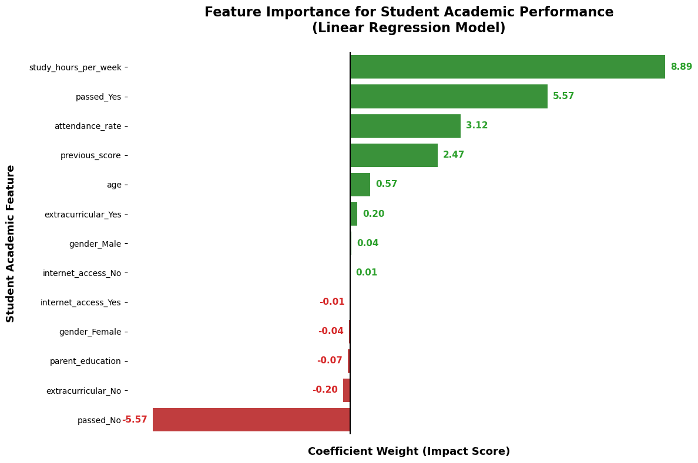
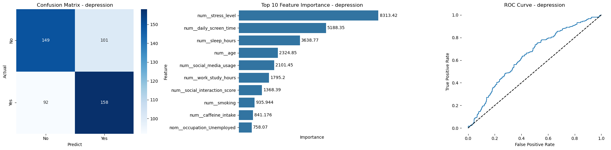
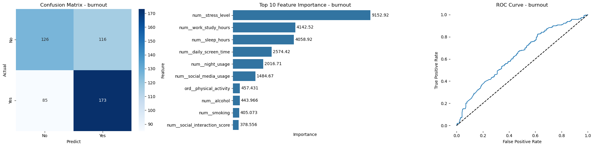
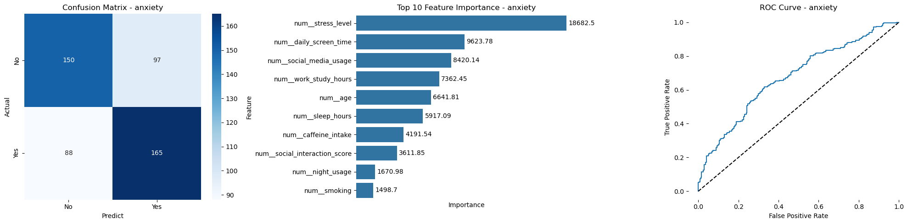
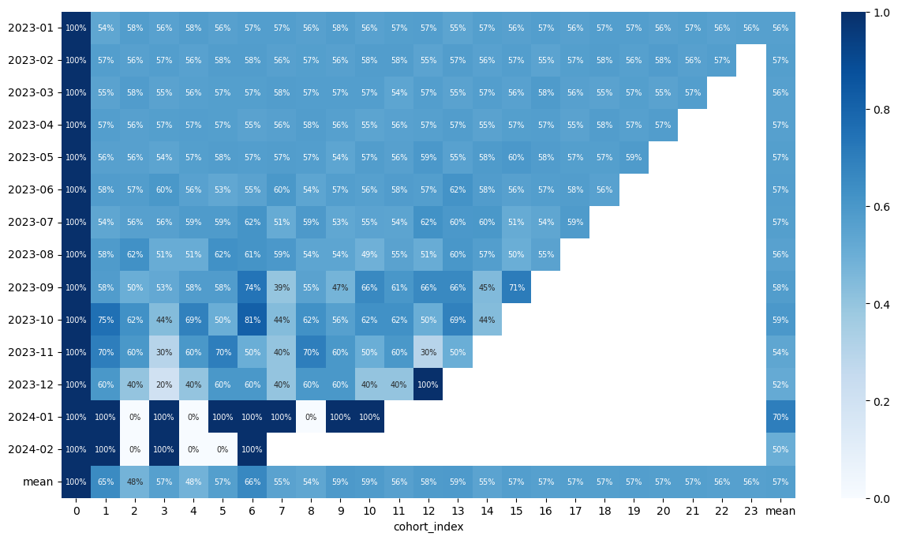
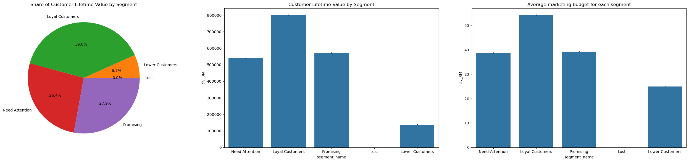

# Welcome to Sakda's Portfolio
Thank you for visiting my portfolio. Please feel free to reach out if you would like to discuss my projects, ask questions, or request more information.

> 💡 **Note:** Click on the project titles to see more details in the repository.

# [Project: Thailand Temperature Forecasting](https://github.com/Sakda-Phoda/Temperature_Forecasting)
* **Objective:** This project helps businesses, agricultural planners, and policymakers in Thailand anticipate weather patterns and plan their operations effectively by providing a highly accurate 12-month temperature forecast..
* **Data Preparation:** Cleaned and verified daily temperature records (2022-2025) to ensure a complete dataset with no missing values.
* **Exploratory Data Analysis (EDA):** Identified highly consistent, normally distributed seasonal temperature patterns.
* **Model Building:** Engineered time-based features (including Fourier terms and lags) and evaluated Prophet, SARIMAX, and LightGBM algorithms.
* **Model Performance:** Selected the Tuned Prophet model as the optimal approach, achieving an impressive 4.07% CV MAPE and revealing a slight downward cooling trend for 2026.

# [Project: Thailand Temperature Forecasting](https://github.com/Sakda-Phoda/Exam_Score_Prediction)
* **Objective:** Help educators and students improve academic performance by identifying actionable behaviors and enabling early intervention.
* **Data Processing & EDA:** Cleaned the dataset by handling missing values and analyzed feature distributions to uncover initial patterns.
* **Model Building & Feature Engineering:** Developed a robust preprocessing pipeline and trained an interpretable Linear Regression model.
* **Model Performance:** Achieved an R² of 0.80 and MAE of 5.54, identifying study hours and past performance as the strongest predictors of final scores.

# [Project: Mental Health Prediction](https://github.com/Sakda-Phoda/Mental_Health_Prediction)
* **Objective:** I built this machine learning pipeline to predict the risk of Depression, Anxiety, and Burnout based on daily lifestyle habits, helping healthcare professionals and individuals identify early warning signs and proactively manage their mental well-being.
* **Data Processing & EDA:** I cleaned the dataset, analyzed the highly balanced target classes, and explored key behavioral distributions before applying transformations like Yeo-Johnson and Standardization.
* **Model Building & Feature Engineering:** I constructed a robust preprocessing pipeline using `ColumnTransformer` and trained an optimized `LightGBM` model using `Optuna` for automated hyperparameter tuning.
* **Model Performance:** I evaluated the models using F1-score and accuracy, where the Burnout prediction model performed best, achieving an F1-Score of 0.60 and demonstrating strong predictive capability in identifying high-risk individuals.
<<<<<<< HEAD

# [Project: Predictive CLV Segmentation](https://github.com/Sakda-Phoda/Predictive_CLV_Segmentation)
* **Objective:** I developed a predictive model and segmentation strategy to estimate Customer Lifetime Value (CLV), helping marketing and sales teams identify high-value customers and optimize their targeted campaigns to maximize long-term revenue.
* **Data Processing** I cleaned and aggregated transactional data into customer-level metrics, focusing on Cohort Analysis and RFM (Recency, Frequency, Monetary) feature extraction to understand purchasing patterns.
* **Model Building & Feature Engineering:** I engineered RFM features and built probabilistic models, specifically using the BG/NBD model to predict purchase frequency and the Gamma-Gamma model to predict monetary value, followed by GMM Clustering to segment customers based on their predicted lifetime value and probability of remaining active.
* **Key Findings:** Using GMM clustering, I successfully segmented customers into 5 distinct profiles (Loyal, Promising, Need Attention, Lower, Lost). This enabled me to pinpoint that Loyal and Need Attention customers are the core revenue drivers, and I established clear Customer Retention Cost (CRC) benchmarks (e.g., $54 for Loyal Customers) to strategically allocate marketing budgets.

